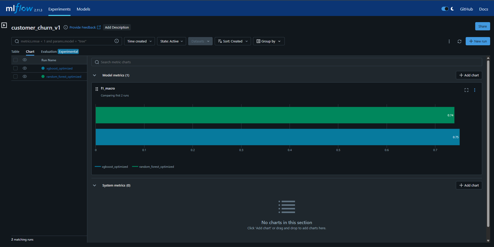
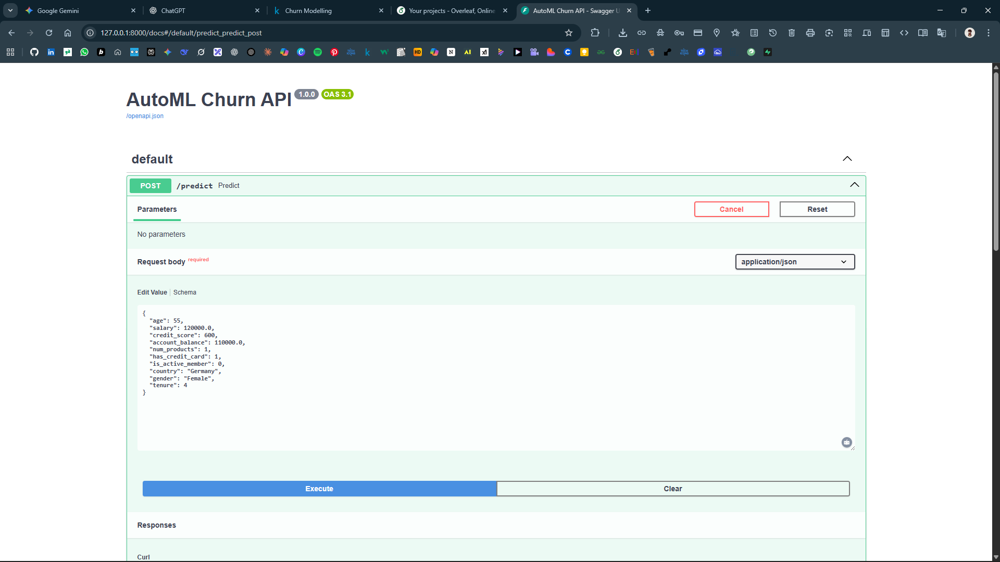

# 🏦 End-to-End AutoML Churn Prediction Pipeline


## 📌 Project Overview
This project is a production-grade **AutoML Pipeline** designed to predict bank customer churn. Unlike standard tutorials, this system simulates a real-world MLOps environment by automating data ingestion, hyperparameter tuning, and model deployment.

It uses **Optuna** to competitively train XGBoost vs. Random Forest, automatically selecting and deploying the winner (XGBoost) to a **FastAPI** microservice.

## 📸 Proof of Performance

### 1. Automated Experiment Tracking (MLflow)
The system automatically tracks metrics for every run. As seen below, **XGBoost (Blue)** achieved a higher F1-score (0.75) than Random Forest (Green), so the system automatically promoted it to production.



### 2. Live API Deployment
The best model is served via a REST API. Below is a live prediction for a "High Risk" customer profile (Older, German, Inactive), correctly predicted as **Churn (1)**.



## 🛠️ Tech Stack
* **Orchestration:** Python Scripts (Modular Architecture)
* **AutoML:** Optuna (Bayesian Optimization)
* **Tracking:** MLflow (Experiment Logging & Model Registry)
* **Serving:** FastAPI & Uvicorn
* **Containerization:** Docker

## 🚀 How to Run locally

1.  **Install Dependencies:**
    ```bash
    pip install -r requirements.txt
    ```

2.  **Train the Model:**
    ```bash
    python run_pipeline.py --data data/raw/Churn_Modelling.csv
    ```

3.  **Start the API:**
    ```bash
    uvicorn app.main:app --reload
    ```